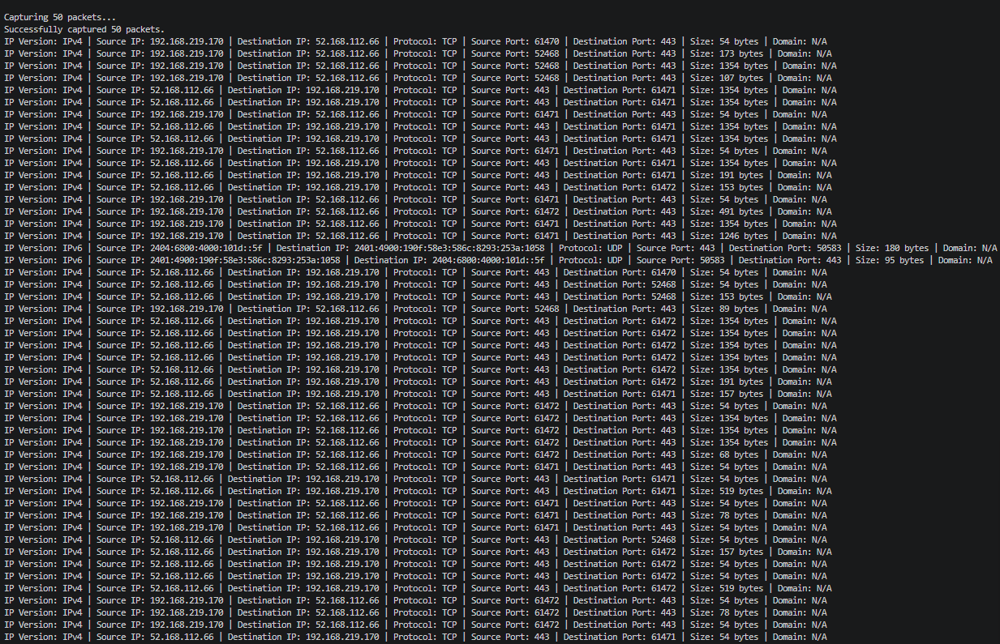
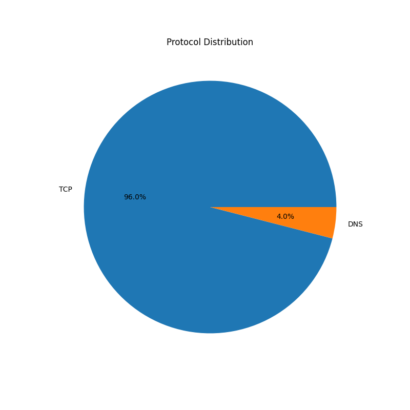

# Network Traffic Analyzer & Packet Inspection Tool

A Python-based network traffic analyzer that captures and inspects live network packets using Scapy. The tool analyzes IPv4/IPv6 traffic, extracts protocol and packet information, performs basic security analysis, visualizes protocol distribution, and exports packet statistics for network monitoring and troubleshooting.

## Architecture

```text
                 Live Network
                      │
                 Packet Capture
                 (Scapy Sniff)
                      │
              Packet Analyzer
                      │
      ┌───────────────┼───────────────┐
      │               │               │
Protocol Stats   Security Check   Packet Details
      │               │               │
      └───────────────┼───────────────┘
                      │
      CSV Export   Pie Chart   Console Report
```
---

## Features

### Packet Capture
- Capture live network packets using Scapy
- Support for IPv4 and IPv6 traffic
- Configurable packet capture limit

### Packet Analysis
- Source and Destination IP addresses
- Source and Destination Ports
- Packet Size
- IP Version Detection
- DNS Query Extraction

### Supported Protocols
- TCP
- UDP
- DNS
- ICMP
- ARP
- IPv4
- IPv6

### Traffic Statistics
- Protocol Distribution
- Top Network Talkers
- Packet Size Statistics
- Bandwidth Estimation

### Security Analysis
- Basic ICMP Ping Flood Detection
- Basic TCP Port Scan Detection
- Configurable detection thresholds

### Data Export
- Export captured packet details to CSV
- Generate protocol distribution pie chart

---

## Project Structure

```text
network-traffic-analyzer/
│
├── main.py
├── config.py
├── requirements.txt
├── README.md
├── LICENSE
├── .gitignore
│
├── modules/
│   ├── __init__.py
│   ├── analyzer.py
│   ├── capture.py
│   ├── exporter.py
│   ├── security.py
│   └── visualizer.py
│
├── charts/
│   └── protocol_distribution.png
│
├── exports/
│   └── network_traffic.csv
│
└── screenshots/
    ├── terminal-output.png
    └── protocol_distribution.png
```

---

## Technologies Used

- Python 3
- Scapy
- Pandas
- Matplotlib
- TCP/IP
- IPv4
- IPv6
- DNS
- Linux / Windows

---

## Installation

Clone the repository

```bash
git clone https://github.com/Omsaigulhane/network-traffic-analyzer.git
```

Move to the project directory

```bash
cd network-traffic-analyzer
```

Install dependencies

```bash
pip install -r requirements.txt
```

Run the application

```bash
python main.py
```

---

## Sample Output

```text
NETWORK TRAFFIC ANALYSIS REPORT

Total Packets Captured : 50

Protocol Statistics
TCP : 38
DNS : 8
UDP : 4

Top Talkers
192.168.219.170 : 15

Packet Size Statistics
Average Packet Size : 335 bytes
Maximum Packet Size : 1354 bytes
Minimum Packet Size : 54 bytes

Bandwidth Estimation
Estimated Bandwidth : 0.028 Mbps

Security Analysis
Ping Flood : Not Detected
Port Scan : Not Detected
```

---

## Screenshots

### Terminal Output



### Protocol Distribution



---

## Skills Demonstrated

- Python Programming
- Network Packet Analysis
- TCP/IP Fundamentals
- DNS Analysis
- IPv4 & IPv6
- Network Monitoring
- Packet Inspection
- Traffic Visualization
- Security Analysis
- Data Export
- Troubleshooting
- Git & GitHub

---

## Future Improvements

- Real-time traffic dashboard
- HTTP and HTTPS traffic analysis
- Packet filtering
- Multiple interface support
- JSON export
- Live bandwidth monitoring
- Advanced anomaly detection

---

## Why I Built This Project

This project was developed to strengthen practical networking skills by capturing and analyzing live network traffic. It demonstrates packet inspection, protocol analysis, traffic visualization, and basic security monitoring concepts commonly used in network troubleshooting and Site Reliability Engineering (SRE).

---

## License

This project is licensed under the MIT License.
